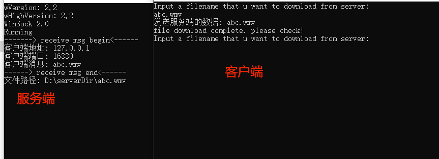
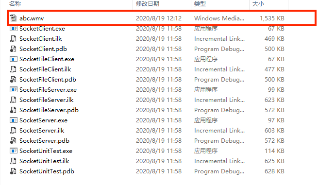

# Socket

## Demo介绍
这是Socket C++版本的实现。仅仅是一个demo，不复杂，用作学习是极好的.  

## 目录说明
SocketClient: Socket客户端实现, 可以发送字符串消息  
SocketServer: Socket服务端实现, 可以接受字符串消息, 并回发给客户端  
SocketFileClient: Socket实现传输文件的客户端实现  
SocketFileServer: Socket实现传输文件的服务端实现  

## 操作说明
1. 重新生成解决方案，在项目目录下有一个x64的目录  
2. 先执行服务端程序(exe中包含server)，在执行客户端程序(exe中包含client)  
3. 如果是字符串Socket的, 在控制台输入想要发送的字符串即可. 如果是文件Socket, 输入想要下载的文件名(记得该一下路径)即可  

## 学习资料参考:
http://c.biancheng.net/cpp/html/3046.html  